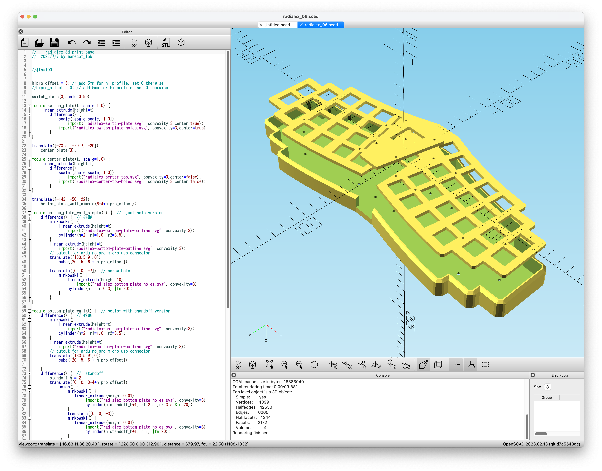
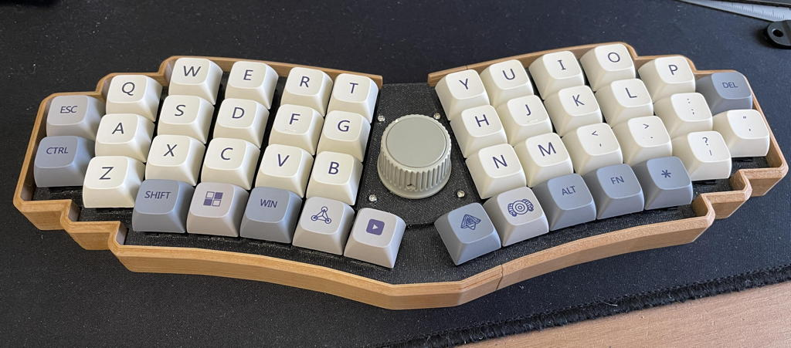
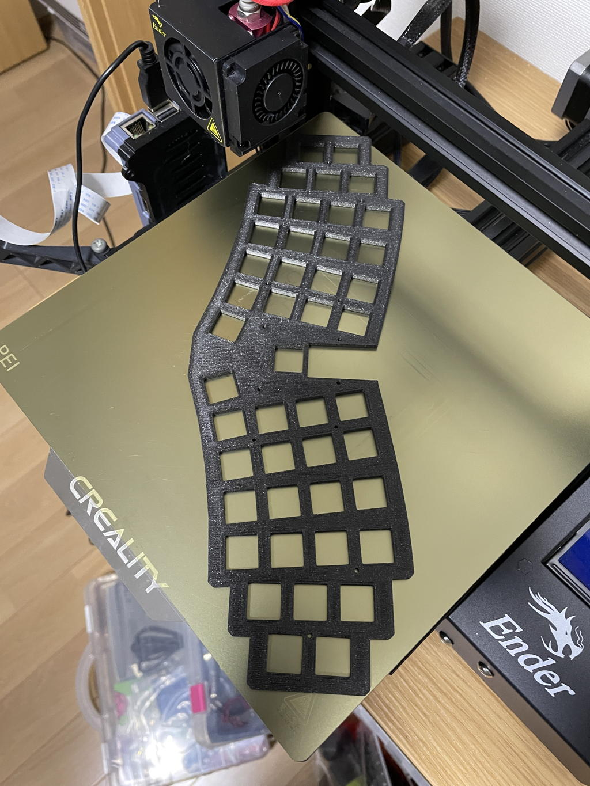
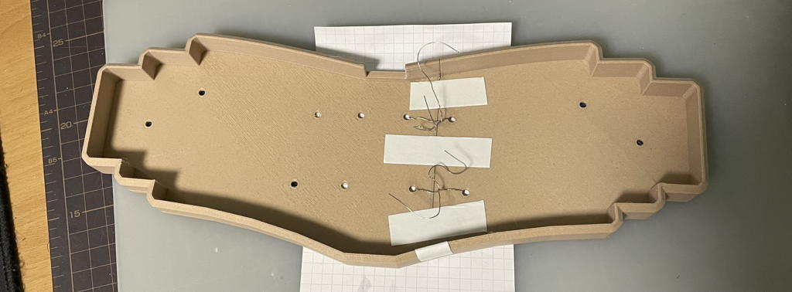
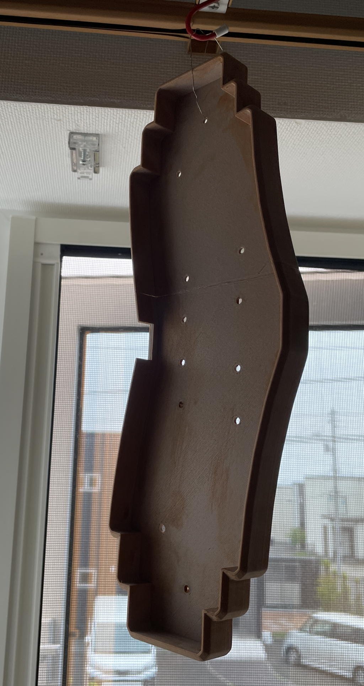

# radialex-3dprint-case

<a href="https://github.com/takashicompany/radialex">Radialex keyboard</a> 3d design case written  by OpenSCAD.

完成イメージです。中央のスイッチの代わりにロータリーエンコーダを配置してみました。

スイッチプレートを斜めに配置すると、Ender3でギリギリ印刷可能です。余裕がないので、スカートやブリムはつけられません。

ボトムケースはスライサー機能で２分割して出力して、接着しています。（半分ではなく、端から120mmで分割しました。）300mm級の大きなプリンターでは分割不要です。

ボトムケースは木材フィラメントで印刷したので、接着後に軽くヤスリがけして、ステンで塗装してみました。
